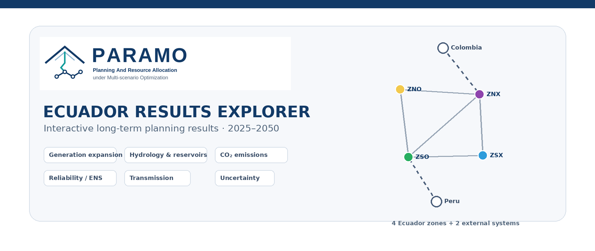
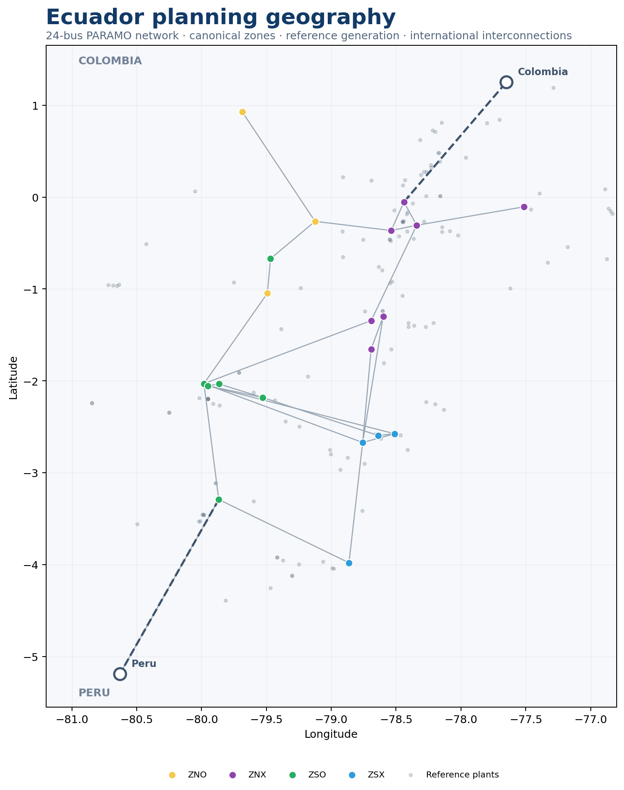
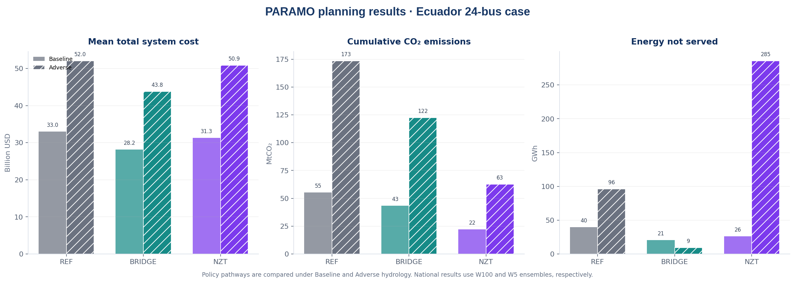

  

<strong>Interactive long-term power-system planning results for Ecuador</strong>

  
  &nbsp;&nbsp;
  

  

# PARAMO Ecuador Results Explorer

**PARAMO — Planning And Resource Allocation under Multi-scenario Optimization** is a long-term power-system planning framework for hydro-dependent systems. This public repository provides interactive results for two Ecuador planning applications, covering expansion, hydrology, operation, decarbonization, reliability, costs and uncertainty.

<a href="https://wilianguaman.github.io/PARAMO-Ecuador/"><strong>▶ OPEN THE INTERACTIVE RESULTS EXPLORER</strong></a>

## Study cases

| Study case | Planning pathways | Hydrology | Uncertainty | Public result scope |
|---|---|---|---|---|
| **Ecuador 24-Bus National Planning Case** | REF · BRIDGE · NZT | Baseline · Adverse | W100 · W5 | Generation expansion, operation, reservoirs, CO₂, ENS, costs, uncertainty and transmission-investment context |
| **Ecuador 6-Bus Reduced Planning Case** | BAU · REN100 | Normal · Extreme | Single realization | Generation/transmission expansion, corridor utilization, reservoirs, CO₂, ENS and costs |

## Ecuador planning geography

The map links the reduced PARAMO representation to georeferenced Ecuador Power DataHub records. Internal planning nodes are shown by canonical zone, reference generation assets provide physical context, and **Colombia and Peru are retained as external systems in both study representations**.

The public geography distinguishes verified/canonical coordinates from schematic external-system display anchors. The 6-bus public tables use the canonical zone convention and retain the original model zone codes in traceability fields.

## Planning outcomes

Cost, CO₂ emissions and energy not served are reported together so that economic, decarbonization and reliability trade-offs remain visible.

Selected national results include:

- **BRIDGE · Baseline:** mean total system cost of **28.18 billion USD** and cumulative emissions of **43.36 MtCO₂**.
- **NZT · Baseline:** cumulative emissions of **22.02 MtCO₂**, the lowest of the three national pathways under Baseline hydrology.
- **Adverse hydrology:** higher costs and emissions across the national pathways, quantifying the consequences of hydro-climatic stress.
- **Reliability:** ENS is reported by pathway, hydrology, year and uncertainty statistic rather than treated as a secondary indicator.

## Interactive explorer

The dashboard includes generation expansion, transmission and reconductoring context, hydrology and reservoirs, system operation, emissions, ENS, cost/uncertainty analysis and direct scenario comparison. The 24-bus Baseline ensemble contains **100 Monte Carlo realizations** and the Adverse ensemble contains **5**. Mean, P10, P50 and P90 selections are applied to the cumulative indicators available at ensemble level; annual and monthly operational trajectories are identified as representative-realization results.

Every chart supports data/figure export. A selected configuration can be downloaded as a ZIP directly from the browser.

## Public data

**Complete dataset:** [`PARAMO_Ecuador_Public_Results_v1.0.3.zip`](downloads/PARAMO_Ecuador_Public_Results_v1.0.3.zip)

The public distribution contains curated result tables, geography, crosswalks, metric definitions and provenance metadata. It excludes the private optimization implementation, private InputData workbooks, GDX/LST files and solver logs.

Technical documentation:

- [`docs/METHODOLOGY.md`](docs/METHODOLOGY.md)
- [`docs/DATA_PROVENANCE.md`](docs/DATA_PROVENANCE.md)
- [`docs/LIMITATIONS.md`](docs/LIMITATIONS.md)
- [`data/metadata/data_dictionary.csv`](data/metadata/data_dictionary.csv)

## Citation

**PARAMO Ecuador Results Explorer**

> Guamán Cuenca, W. (2026). *PARAMO Ecuador Results Explorer: Planning And Resource Allocation under Multi-scenario Optimization* (Version 1.0.3) [Software and public research results]. GitHub. https://github.com/WilianGuaman/PARAMO-Ecuador

**Associated methodology**

> Guamán, W., Benalcazar, P., Cordova-Garcia, J., & Torres, M. (2025). *An integrated framework for the optimal expansion of hydro-dependent power systems under water-resource uncertainty*. **Energy Conversion and Management: X, 28**, 101297. https://doi.org/10.1016/j.ecmx.2025.101297

Machine-readable citation: [`CITATION.cff`](CITATION.cff). Additional formats: [`BibTeX`](docs/citation/CITATION.bib) · [`RIS`](docs/citation/CITATION.ris).

## Licensing

| Component | Terms |
|---|---|
| Dashboard source code | **Apache License 2.0** |
| PARAMO-derived public results, original figures and documentation | **CC BY 4.0** |
| Third-party reference data | Original source terms apply |
| PARAMO optimization model and non-public model assets | **Not distributed** |

Copyright © 2026 **Wilian Guamán Cuenca**. See [`LICENSES.md`](LICENSES.md) for component-level terms and attribution.

  <a href="https://wilianguaman.github.io/PARAMO-Ecuador/"><strong>Open Dashboard</strong></a> ·
  <a href="docs/CITATION.md"><strong>Cite PARAMO</strong></a> ·
  <a href="downloads/PARAMO_Ecuador_Public_Results_v1.0.3.zip"><strong>Download Data</strong></a>

