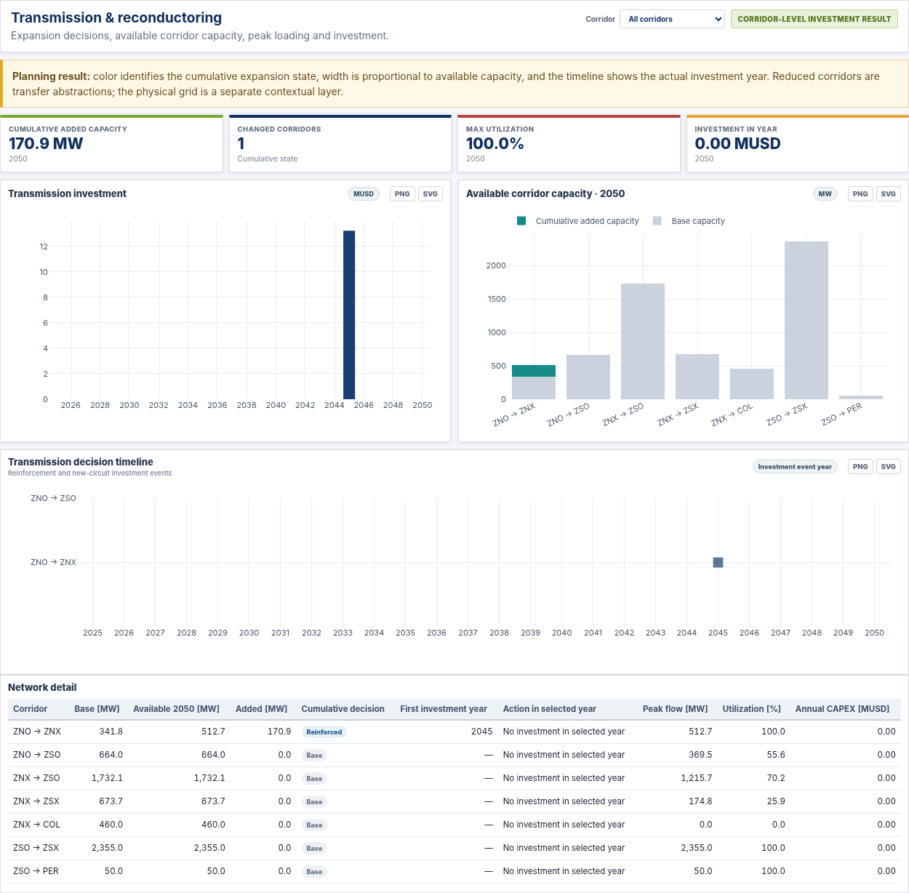
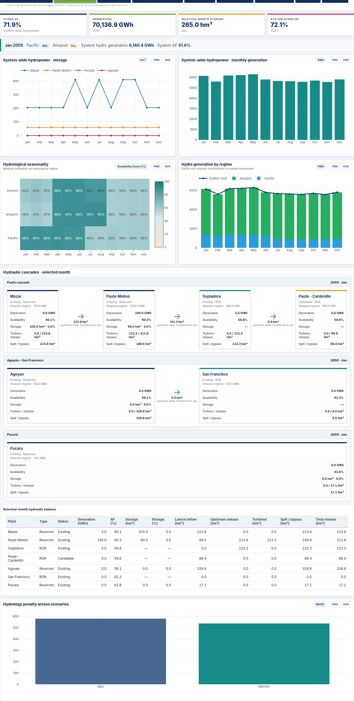
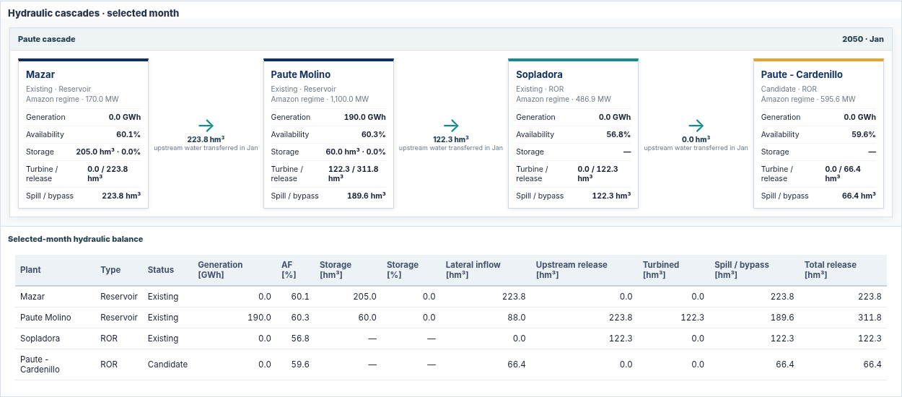

<p align="center">
  
</p>

<p align="center">
  <strong>PARAMO Ecuador Results Explorer</strong><br>
  Long-term generation, transmission and hydropower planning under hydrological uncertainty · 2025–2050
</p>

<p align="center">
  <a href="https://wilianguaman.github.io/PARAMO-Ecuador/"></a>
  &nbsp;&nbsp;
  <a href="https://github.com/WilianGuaman/PARAMO-Ecuador/issues/new?template=data-access-request.yml"></a>
</p>

<p align="center">
  <a href="https://github.com/WilianGuaman/PARAMO-Ecuador/issues/new?template=data-access-request.yml"><strong>Request research data</strong></a>
  &nbsp;·&nbsp;
  <a href="docs/CITATION.md"><strong>Cite PARAMO</strong></a>
  &nbsp;·&nbsp;
  <a href="docs/METHODOLOGY.md"><strong>Methodology</strong></a>
</p>

---

## Overview

**PARAMO** — *Planning And Resource Allocation under Multi-scenario Optimization* — is a long-term power-system planning framework for hydro-dependent systems. This repository contains the public Ecuador Results Explorer, not the optimization engine or the private research database.

The explorer combines two complementary study cases:

| Study case | Policy pathways | Hydrology | Public uncertainty representation |
|---|---|---|---|
| **Ecuador 24-Bus** | REF, BRIDGE, NZT | Baseline, Adverse | Aggregate Monte Carlo statistics plus representative trajectories |
| **Ecuador 6-Bus** | BAU, REN100 | Normal, Extreme | Four validated single-realization planning cases (`W=1`) |

The 6-bus public results were regenerated from the current PARAMO output layer. All four configurations completed with `ModelStat = 8`, `SolveStat = 1`, MIP gap below 1%, zero base-year endogenous build, and numerical balance residuals within tolerance. See [`docs/VALIDATION.md`](docs/VALIDATION.md).

## Explorer

The interface is organized around planning questions rather than raw result files:

- **Overview** — system cost, cumulative CO₂, ENS, expansion and final renewable share.
- **Generation Expansion** — capacity, additions and annual generation by technology or fuel/resource.
- **Transmission & Reconductoring** — 6-bus corridor capacity, expansion/reinforcement state, peak flow, utilization and investment.
- **Hydrology & Reservoirs** — hydro availability, reservoir operation and selected hydraulic cascades.
- **System Operation** — monthly energy balance, reserve, curtailment, imports and ENS.
- **Emissions & Decarbonization** — annual and cumulative carbon outcomes.
- **Reliability & ENS** — reliability trajectories and cost trade-offs.
- **Costs & Uncertainty** — cost composition and available uncertainty summaries.
- **Scenario Comparison** — common indicators for two selected configurations.

The map distinguishes reduced planning corridors from the georeferenced reference network. Reference plants can be displayed independently. The physical grid is visible by default and can be filtered to 500, 230, 138 or 69 kV. For the 6-bus case, corridor width represents available capacity and corridor color identifies the cumulative expansion state.

### Transmission decisions

<p align="center">
  
</p>

The 6-bus transmission view separates the original transfer capability, available capacity in the selected year, cumulative reinforcement/new-circuit state, first intervention year, annual action, peak flow, utilization and CAPEX. The georeferenced physical grid remains a contextual layer and is never presented as an optimized corridor decision.

## Hydropower cascades

The reduced Ecuador case includes explicit hydraulic relationships used in the explorer:

- **Paute:** Mazar → Paute Molino → Sopladora → Cardenillo
- **Agoyán:** Agoyán → San Francisco
- **Pucará:** independent reservoir

The public hydrology view combines true system-wide monthly hydropower, Pacific/Amazon availability and generation profiles, reservoir storage/output data, and a separate cascade-hydraulics layer for zero-storage run-of-river plants. This avoids treating every hydro plant as a reservoir while preserving the water-transfer information needed to interpret the cascades.

<p align="center">
  
</p>

<p align="center">
  
</p>

## Public-data policy

This repository intentionally does **not** distribute the full model-result database. GitHub Pages is a static application: any value delivered to the browser is technically accessible. The browser bundle therefore contains only the aggregates and selected diagnostics required by the public visualizations.

Not distributed through this repository:

- PARAMO GAMS source/model implementation;
- InputData workbooks;
- GDX, LST and solver-log files;
- the complete Results workbook;
- full generator-level annual/build outputs;
- Monte Carlo realization-level result tables.

Additional research data may be requested using the repository data-access form. Requests are reviewed before any non-public material is shared.

**Data access:** [`docs/DATA_ACCESS.md`](docs/DATA_ACCESS.md) · [Open request form](https://github.com/WilianGuaman/PARAMO-Ecuador/issues/new?template=data-access-request.yml)

## Public repository structure

```text
PARAMO-Ecuador/
├─ index.html                     # GitHub Pages explorer
├─ assets/
│  ├─ js/dashboard.js             # visualization logic
│  ├─ js/dashboard_data.js        # minimal chart-ready public bundle
│  ├─ css/dashboard.css
│  ├─ brand/
│  └─ vendor/plotly-3.3.1.min.js
├─ data/
│  ├─ geography/                  # public reference geography
│  └─ metadata/                   # schemas, validation and release manifest
├─ docs/
│  ├─ METHODOLOGY.md
│  ├─ DATA_PROVENANCE.md
│  ├─ DATA_ACCESS.md
│  ├─ VALIDATION.md
│  ├─ LIMITATIONS.md
│  └─ CITATION.md
├─ CITATION.cff
└─ LICENSES.md
```

## Reproducibility and provenance

The dashboard is a publication layer for precomputed PARAMO results. The source result workbooks are audited offline before a public bundle is generated. The public release retains case/scenario metadata, validation summaries and file hashes without exposing the complete research database.

- [`docs/DATA_PROVENANCE.md`](docs/DATA_PROVENANCE.md)
- [`data/metadata/public_bundle_schema.json`](data/metadata/public_bundle_schema.json)
- [`data/metadata/validation/ecuador_6bus_v2_validation.json`](data/metadata/validation/ecuador_6bus_v2_validation.json)
- [`data/metadata/public_release_manifest.csv`](data/metadata/public_release_manifest.csv)

## Citation

**Explorer / software release**

> Guamán Cuenca, W. (2026). *PARAMO Ecuador Results Explorer: Planning And Resource Allocation under Multi-scenario Optimization* (Version 2.1.0) [Software and public research results]. GitHub. https://github.com/WilianGuaman/PARAMO-Ecuador

**Foundational methodology**

> Guamán, W., Benalcazar, P., Cordova-Garcia, J., & Torres, M. (2025). *An integrated framework for the optimal expansion of hydro-dependent power systems under water-resource uncertainty*. **Energy Conversion and Management: X, 28**, 101297. https://doi.org/10.1016/j.ecmx.2025.101297

Machine-readable citation: [`CITATION.cff`](CITATION.cff) · [`BibTeX`](docs/citation/CITATION.bib) · [`RIS`](docs/citation/CITATION.ris)

## Licensing

| Component | Terms |
|---|---|
| Dashboard source code | Apache License 2.0 |
| PARAMO-derived public visualization data and original documentation | CC BY 4.0 where indicated |
| Plotly.js | MIT License |
| Third-party reference geography | Original source terms apply |
| PARAMO optimization engine and non-public research assets | Not distributed |

See [`LICENSES.md`](LICENSES.md) for component-level terms and attribution.

Copyright © 2026 **Wilian Guamán Cuenca**.


## Version 2.1.0 improvements

- visible engineering units on every chart card and axis;
- author-supplied georeferenced physical grid (69–500 kV) on both maps;
- clear separation between physical lines, 24-bus planning links and 6-bus reduced corridors;
- corridor-level investment timeline and cumulative reinforcement/new-circuit state for the 6-bus case;
- monthly Pacific/Amazon hydrological seasonality and generation profiles;
- system, Paute, Agoyán–San Francisco and Pucará cascade views with selected-month hydraulic balances.

The 24-bus public dataset does not contain optimized line-level build years. The explorer therefore shows physical geometry and planning-link capability without inferring investment decisions.
