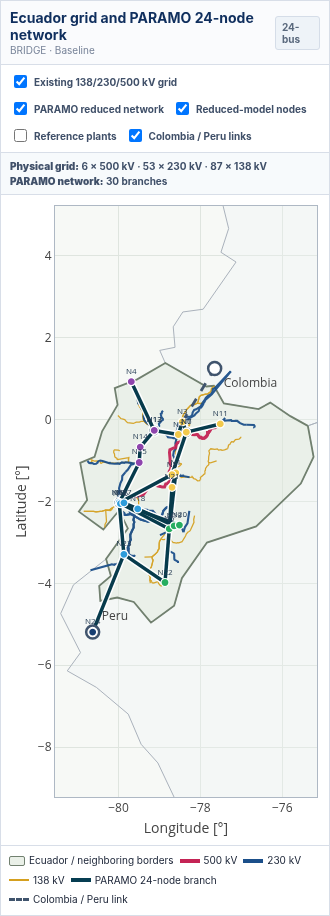
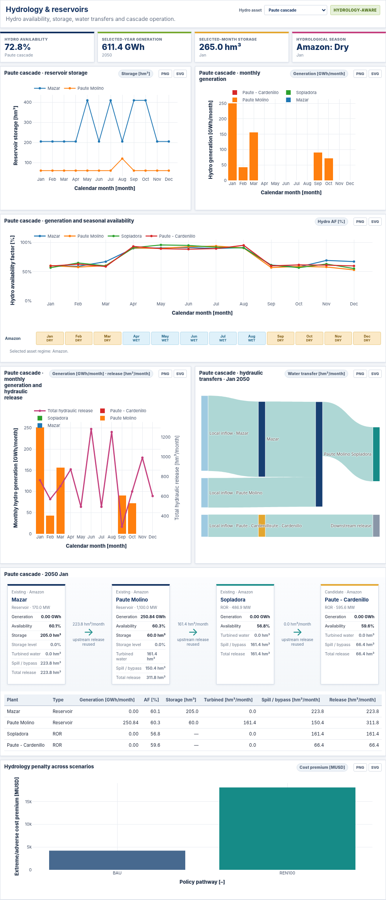

  

  <strong>PARAMO Ecuador Results Explorer</strong> 
  Generation, transmission, hydropower, emissions, reliability and cost results · 2025–2050

  
  &nbsp;&nbsp;
  

## Study cases

| Case | Pathways | Hydrology | Main outputs |
|---|---|---|---|
| **Ecuador 24N** | REF, BRIDGE, NZT | Baseline, Adverse | Ensemble uncertainty, generation expansion, system operation, aggregate transmission investment and reservoir seasonality |
| **Ecuador 6N** | BAU, REN100 | Normal, Extreme | Generation expansion, corridor-year transmission decisions, reservoir operation and selected hydraulic cascades |

## Network representation

The map combines the existing **138, 230 and 500 kV** transmission grid with the active PARAMO network. The physical grid and the 24N/6N planning network can be enabled independently.

  

## Hydropower operation

The hydrology section reports seasonal generation and storage. The 6N case also represents the Paute and Agoyán–San Francisco cascades.

  

## Documentation

- [Dashboard guide](docs/DASHBOARD_GUIDE.md)
- [Methodology](docs/METHODOLOGY.md)
- [Data provenance](docs/DATA_PROVENANCE.md)
- [Validation](docs/VALIDATION.md)
- [Limitations](docs/LIMITATIONS.md)
- [Data access](docs/DATA_ACCESS.md)
- [Citation](docs/CITATION.md)

## Citation

> Guamán Cuenca, W. (2026). *PARAMO Ecuador Results Explorer: Planning And Resource Allocation under Multi-scenario Optimization* (Version 2.7.0). GitHub. https://github.com/WilianGuaman/PARAMO-Ecuador

Foundational publication: Guamán, W., Benalcazar, P., Cordova-Garcia, J., & Torres, M. (2025). *An integrated framework for the optimal expansion of hydro-dependent power systems under water-resource uncertainty*. **Energy Conversion and Management: X, 28**, 101297. https://doi.org/10.1016/j.ecmx.2025.101297

## Licensing

Dashboard code: Apache License 2.0. Public visualization data and original documentation: CC BY 4.0 where indicated. See [LICENSES.md](LICENSES.md).
