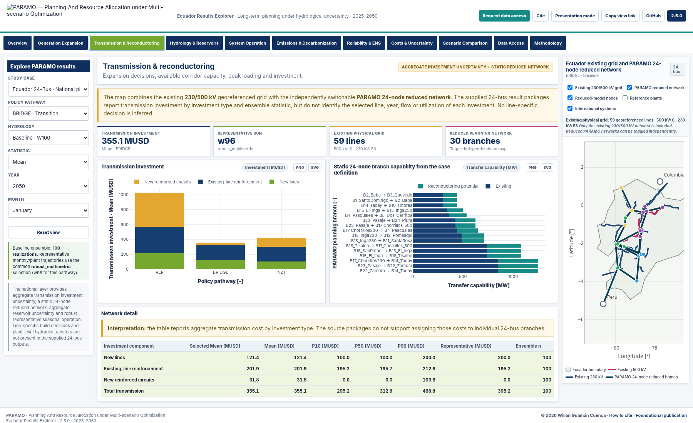
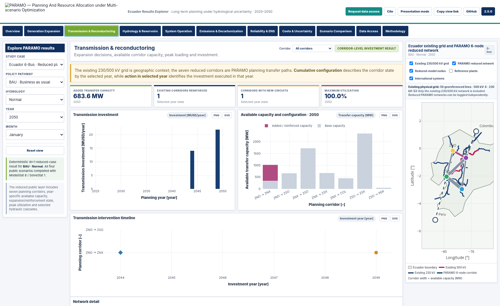
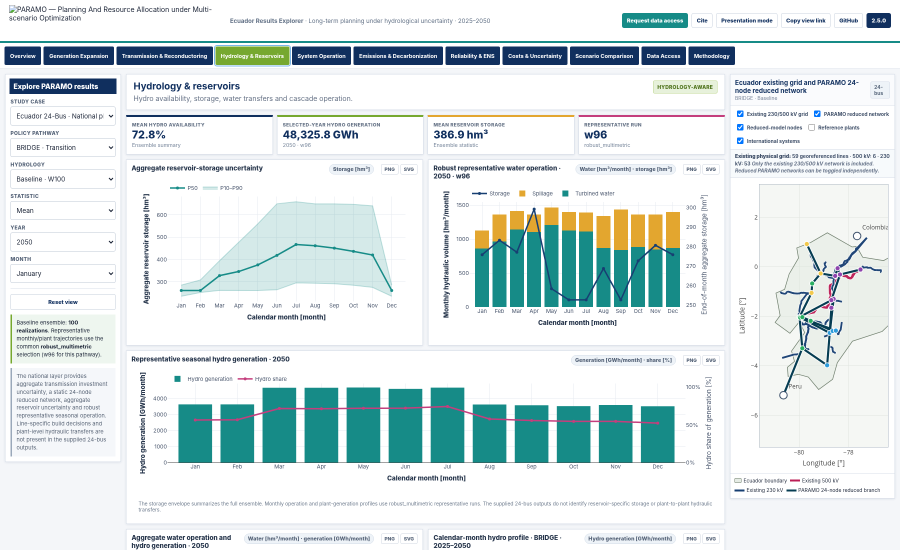

<p align="center">
  
</p>

<p align="center">
  <strong>PARAMO Ecuador Results Explorer</strong><br>
  Long-term generation, transmission and hydropower planning under hydrological uncertainty · 2025–2050
</p>

<p align="center">
  <a href="https://wilianguaman.github.io/PARAMO-Ecuador/"></a>
  &nbsp;&nbsp;
  <a href="https://github.com/WilianGuaman/PARAMO-Ecuador/issues/new?template=data-access-request.yml"></a>
</p>

<p align="center">
  <a href="docs/CITATION.md"><strong>Cite PARAMO</strong></a>
  &nbsp;·&nbsp;
  <a href="docs/METHODOLOGY.md"><strong>Methodology</strong></a>
  &nbsp;·&nbsp;
  <a href="docs/DATA_PROVENANCE.md"><strong>Data provenance</strong></a>
</p>

---

## Overview

**PARAMO** — *Planning And Resource Allocation under Multi-scenario Optimization* — is a long-term power-system planning framework for hydro-dependent systems. This repository contains the public Ecuador Results Explorer. It does not distribute the optimization implementation or the complete research database.

The explorer combines two complementary studies:

| Study case | Policy pathways | Hydrology | Public uncertainty representation |
|---|---|---|---|
| **Ecuador 24-Bus** | REF, BRIDGE, NZT | Baseline, Adverse | Baseline W100 and Adverse W5 aggregate statistics; robust-multimetric representative trajectories |
| **Ecuador 6-Bus** | BAU, REN100 | Normal, Extreme | Four validated deterministic planning cases (`W=1`) |

The study cases are not numerical substitutes for one another. The 24-bus application emphasizes ensemble uncertainty and national seasonal operation. The 6-bus application provides the more recent calibrated case, corridor-year transmission decisions and selected hydraulic-cascade diagnostics.

### Final 6-bus results

The 6-bus layer was rebuilt from the final PARAMO run completed on **30 August 2026**. All four cases completed with `ModelStat = 8`, `SolveStat = 1` and MIP gap below 1%.

| 6-bus case | Total cost [MUSD] | Cumulative CO₂ [MtCO₂] | Cumulative ENS [GWh] | Final renewable share |
|---|---:|---:|---:|---:|
| BAU · Normal | 32,615.81 | 23.44 | 0.00 | 97.81% |
| BAU · Extreme | 36,823.54 | 146.95 | 61.59 | 85.19% |
| REN100 · Normal | 32,741.32 | 21.12 | 0.00 | 100.00% |
| REN100 · Extreme | 50,872.92 | 41.81 | 10,012.06 | 100.00% |

The renewable target and system adequacy are reported separately. A 100% final-year renewable share does not imply zero ENS under extreme hydrology.

## Explorer

The interface is organized around planning questions rather than raw result files:

- **Overview** — system cost, cumulative CO₂, ENS, expansion and final renewable share.
- **Generation Expansion** — capacity, additions and annual generation by technology or fuel/resource.
- **Transmission & Reconductoring** — 24-bus aggregate investment uncertainty and static reduced topology; 6-bus corridor-year decisions.
- **Hydrology & Reservoirs** — 24-bus aggregate storage uncertainty and robust representative seasonal operation; 6-bus reservoir/cascade operation.
- **System Operation** — monthly energy balance, reserve, curtailment, imports and ENS.
- **Emissions & Decarbonization** — annual and cumulative carbon outcomes.
- **Reliability & ENS** — reliability trajectories and cost trade-offs.
- **Costs & Uncertainty** — cost composition and available uncertainty summaries.
- **Scenario Comparison** — common indicators for two selected configurations.

Every numerical Cartesian figure uses explicit engineering units in its axes.

## Ecuador map and transmission networks

The map contains three independent layers:

1. the mainland Ecuador boundary;
2. the **existing 500 and 230 kV georeferenced grid** derived from the supplied `Lineas.geojson`;
3. the active PARAMO reduced network — 24-node or 6-node according to the selected study case.

The physical layer contains 59 line features: 6 at 500 kV and 53 at 230 kV. Lower-voltage records are intentionally excluded from this public view. The physical grid and the reduced PARAMO network can be enabled independently.

<p align="center">
  
</p>

### 24-bus transmission information

The supplied 24-bus results contain ensemble statistics for:

- new-line investment;
- reinforcement of existing lines;
- new reinforced-specification circuits;
- total transmission investment.

They do **not** identify the selected branch, investment year, power flow or utilization for each investment. The explorer therefore reports the investment components honestly at aggregate level and displays the 24-node reduced topology as a static case-definition layer. It does not invent branch-level decisions.

### 6-bus transmission decisions

The 6-bus results identify cumulative corridor configuration, action in the selected year, first investment year, available capacity, added capacity, peak flow, utilization and CAPEX. Corridor width represents available capacity and corridor color identifies the expansion state.

<p align="center">
  
</p>

## Hydrology and reservoir operation

### Ecuador 24-Bus

The national case now uses a common **robust_multimetric** rule to select representative trajectories for Baseline and Adverse hydrology. The complete ensembles remain the source of aggregate statistics.

| Hydrology | Ensemble | BRIDGE | NZT | REF |
|---|---:|---:|---:|---:|
| Baseline | W100 | w96 | w59 | w32 |
| Adverse | W5 | w2 | w5 | w5 |

The 24-bus hydrology view reports:

- aggregate reservoir-storage P10–P50–P90 envelopes;
- representative monthly storage, turbining, spill and release;
- representative hydro generation and share;
- Baseline/Adverse calendar-month hydro profiles over 2025–2050.

The source reservoir results do not include reservoir IDs or plant-to-plant hydraulic-transfer variables. Plant-specific storage and cascade Sankey flows are therefore not inferred for the 24-bus case.

<p align="center">
  
</p>

### Ecuador 6-Bus

The reduced case includes explicit hydraulic relationships used in the explorer:

- **Paute:** Mazar → Paute Molino → Sopladora → Cardenillo;
- **Agoyán:** Agoyán → San Francisco;
- **Pucará:** independent reservoir.

The public hydrology view combines reservoir storage/output data with a separate cascade-hydraulics layer for zero-storage run-of-river plants. This avoids treating every hydro plant as a reservoir while preserving the water-transfer information required to interpret the cascades.

## Public-data policy

GitHub Pages is a static application: any value delivered to a web browser can be inspected. The browser bundle therefore contains only the aggregates and selected diagnostics required to render the explorer.

Not distributed through this repository:

- PARAMO GAMS source/model implementation;
- InputData workbooks;
- GDX, LST and solver-log files;
- complete Results workbooks;
- full generator-level annual/build outputs;
- Monte Carlo realization-level result tables.

Additional research data may be requested through the repository data-access form. Approval is not automatic and depends on scope, provenance and redistribution constraints.

**Data access:** [`docs/DATA_ACCESS.md`](docs/DATA_ACCESS.md) · [Open request form](https://github.com/WilianGuaman/PARAMO-Ecuador/issues/new?template=data-access-request.yml)

## Public repository structure

```text
PARAMO-Ecuador/
├─ index.html
├─ assets/
│  ├─ js/dashboard.js
│  ├─ js/dashboard_data.js
│  ├─ js/reference_network_data.js
│  ├─ css/dashboard.css
│  ├─ brand/
│  └─ vendor/plotly-3.3.1.min.js
├─ data/
│  ├─ geography/
│  └─ metadata/
├─ docs/
├─ CITATION.cff
└─ LICENSES.md
```

## Reproducibility and provenance

The dashboard is a publication layer for precomputed PARAMO results. Source result archives are audited offline before the minimum public bundle is generated. The release retains case/scenario metadata, validation summaries and file hashes without exposing the complete research database.

- [`docs/DATA_PROVENANCE.md`](docs/DATA_PROVENANCE.md)
- [`docs/VALIDATION.md`](docs/VALIDATION.md)
- [`docs/LIMITATIONS.md`](docs/LIMITATIONS.md)
- [`data/metadata/public_bundle_schema.json`](data/metadata/public_bundle_schema.json)
- [`data/metadata/public_release_manifest.csv`](data/metadata/public_release_manifest.csv)

## Citation

**Explorer / software release**

> Guamán Cuenca, W. (2026). *PARAMO Ecuador Results Explorer: Planning And Resource Allocation under Multi-scenario Optimization* (Version 2.5.0) [Software and public research results]. GitHub. https://github.com/WilianGuaman/PARAMO-Ecuador

**Foundational methodology**

> Guamán, W., Benalcazar, P., Cordova-Garcia, J., & Torres, M. (2025). *An integrated framework for the optimal expansion of hydro-dependent power systems under water-resource uncertainty*. **Energy Conversion and Management: X, 28**, 101297. https://doi.org/10.1016/j.ecmx.2025.101297

Machine-readable citation: [`CITATION.cff`](CITATION.cff) · [`BibTeX`](docs/citation/CITATION.bib) · [`RIS`](docs/citation/CITATION.ris)

## Licensing

| Component | Terms |
|---|---|
| Dashboard source code | Apache License 2.0 |
| PARAMO-derived public visualization data and original documentation | CC BY 4.0 where indicated |
| Plotly.js | MIT License |
| Third-party reference geography | Original source terms apply |
| PARAMO optimization engine and non-public research assets | Not distributed |

See [`LICENSES.md`](LICENSES.md) for component-level terms and attribution.

Copyright © 2026 **Wilian Guamán Cuenca**.

## v2.5.0 national-case and map refresh

Version 2.5.0 rebuilds the 24-bus representative trajectories with a common robust-multimetric selection rule, adds national hydrology and transmission-investment views, restricts the physical map to the existing 230/500 kV grid, introduces the Ecuador boundary and makes the 6-node/24-node reduced networks independently switchable. See [`docs/RELEASE_NOTES_v2.5.0.md`](docs/RELEASE_NOTES_v2.5.0.md).
